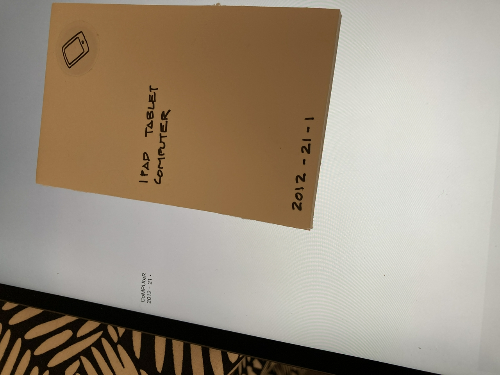
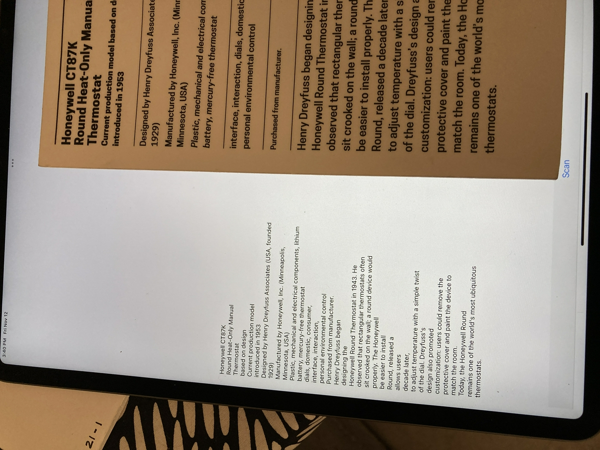
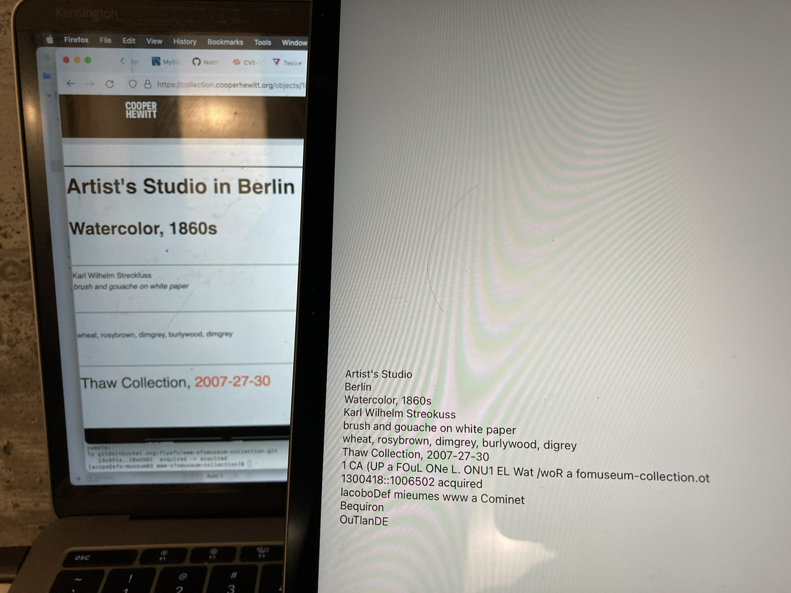
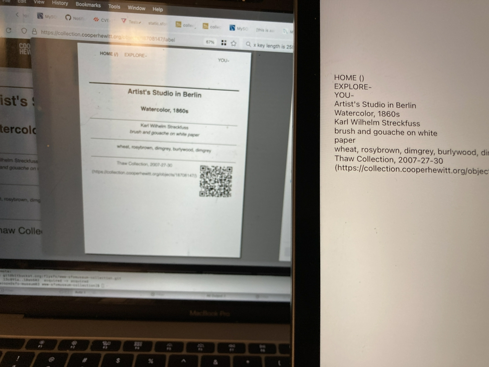
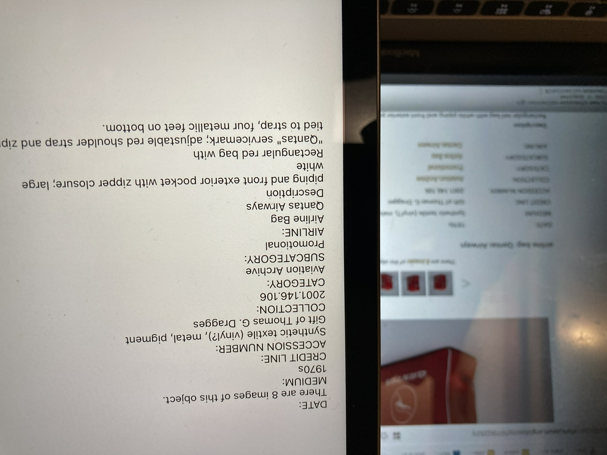

# ios-label-whisperer

iOS application to extract accession numbers from wall labels using Vision and VisionKit frameworks.

## Important

This is experimental work in progress. It is still just a barely modified clone of Apple's [Structuring Recognized Text on a Document](https://developer.apple.com/documentation/vision/structuring_recognized_text_on_a_document) sample project.

It works enough to scan and extract text from a camera source and to print that text to the screen, but that's all it does so far. There is no documentation to speak of. If you're not familiar with your way around an iOS project this may be too soon for you.

### Also

This project was accidentally named `LableWhisperer` in XCode. There are a bunch of things to figure out.

## What does it do?

Currently the application:

* Loads all the "definition" files in [data.bundle](data.bundle) at launch.
* Display a `Choose` button which displays a "table view" for selecting a specific institution and it's rules for extracting accession numbers from text.
* Display a `Scan` button which launches a `VNRecognizedTextObservation` process.
* Call the `ExtractFromText` method (from the [swift-accession-numbers](https://github.com/sfomuseum/accession-numbers) package with the text results of the `VNRecognizedTextObservation` process.
* Display a "table view" with the resulting matches.

## How does it work

* At start up the application loads one or more accession number "definition" files. These are the JSON files in the `data` directory of the [accession-numbers](https://github.com/sfomuseum/accession-numbers) repository. These are used to populate a "table view" to choose a specific institution whose accession numbers are being scanned. This view is presented when a user presses the "Choose" button.

* There is a second button, labeled "Scanned" that invoke iOS's text recognition workflow for scanning a wall label, or other text containing accession numbers.

* Once scanned the application uses the resultant `VNRecognizedTextObservation` instance to build a text string which is then passed to the `ExtractFromText` method (defined in the [swift-accession-numbers](https://github.com/sfomuseum/swift-accession-numbers) package). For example: 

```
    func addRecognizedText(recognizedText: [VNRecognizedTextObservation]) {

        var transcript = ""
        let maximumCandidates = 1
        for observation in recognizedText {
            guard let candidate = observation.topCandidates(maximumCandidates).first else { continue }
            transcript += candidate.string
            transcript += "\n"
        }

	// This is populated with the defintion chosen in the "Choose" table view
	var defintions = [Definitions](...)

	
        let rsp = ExtractFromText(text: transcript, definitions: definitions)

        switch rsp {
        case .failure(let error):
            print("Failed to extract accession numbers from text, \(error).")
        case .success(let results):
            let vc = ScannedViewController()
            vc.matches = results
            present(vc, animated: true, completion: nil)
        }
    }
```

* The accession numbers that were able to be extracted from the text derived from the photograph are then displayed in a separate table view.

* That's it so far.

## Next steps

Next steps are:

* Better error handling and feedback if there are no matching accession numbers.

* Think about actions (or Protocols) for things to _do_ with an accession number. For example, calling an API to get more information about an object. Maybe that doesn't belong here and maybe this just needs to be a plain vanilla package library, or framework, that hides a bunch of boiler-plate code with "a button" that returns accession numbers.

## Help wanted

I don't live and breathe iOS applications so any suggestions or contributions, particularly on the subjects discussed in the `Next steps` section would be welcome.

The goal is to create a framework, or at least a working reference implementation, for an application that can be configured to extract accession numbers from museum wall labels. It should be possible to configure "extractors" for multiple accession numbers and to associate them with one or more museums.

What happens next is probably out of scope for this package and best left to a custom project that imports it.

## Background

For background have a look at the 2014 blog post [Label Whisperer](https://labs.cooperhewitt.org/2014/label-whisperer/) from the Cooper Hewitt labs.

## Examples

### Hand-drawn



### Cooper Hewitt

_Things I'd forgotten about #1: We did not include accession numbers on the wall labels at Cooper Hewitt after the re-opening in 2014._



### Cooper Hewitt (online)



### Cooper Hewitt (online, print)

_Things I'd forgotten about #2: We made a print stylesheet for the experimental `/label` URL for every object page at Cooper Hewitt._



### SFO Museum (online)



## See also

* https://github.com/sfomuseum/accession-numbers
* https://github.com/sfomuseum/swift-accession-numbers
* https://labs.cooperhewitt.org/2014/label-whisperer/
* https://github.com/cooperhewitt/label-whisperer
* https://developer.apple.com/documentation/vision/structuring_recognized_text_on_a_document
