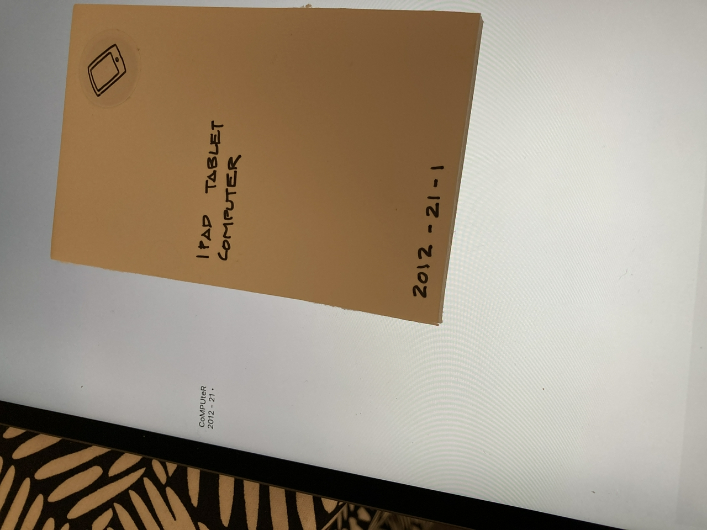
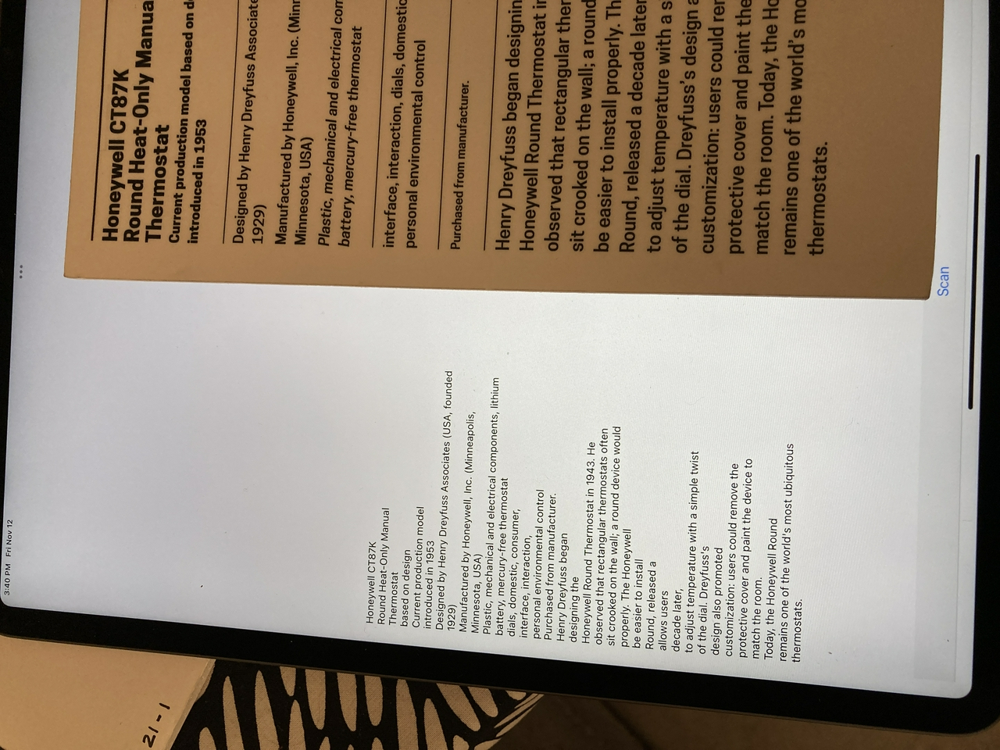
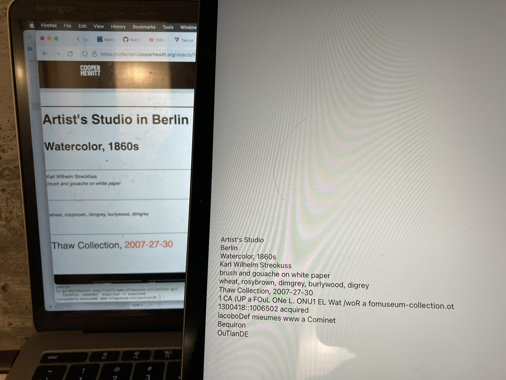
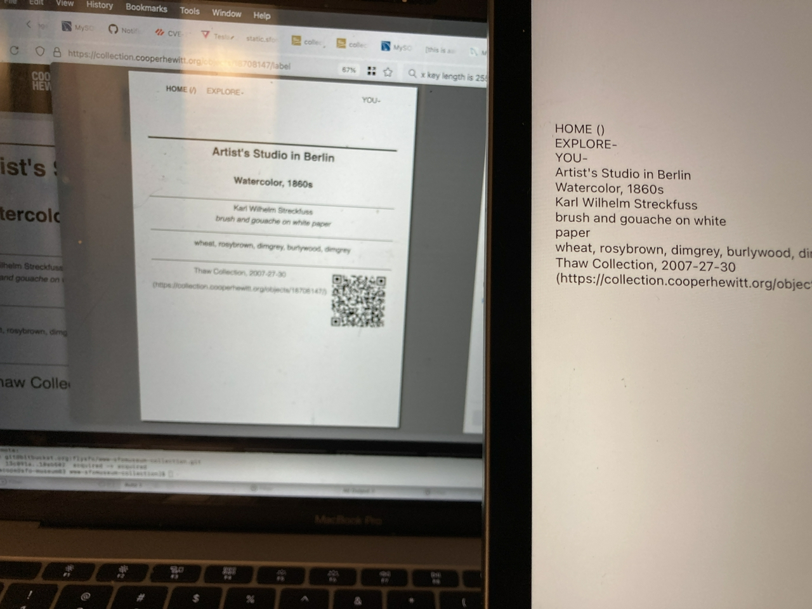
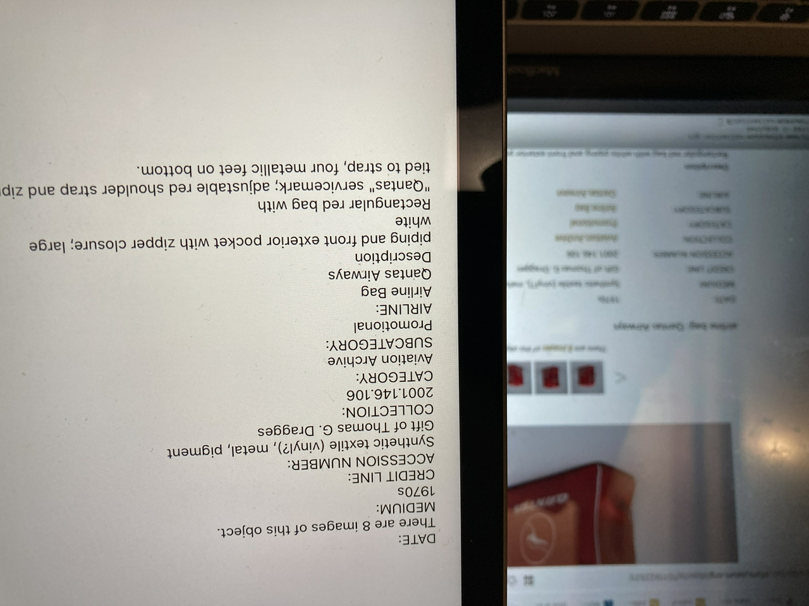

# ios-label-whisperer

iOS application to extract accession numbers from wall labels using Vision and VisionKit frameworks.

## Important

This is experimental work in progress. It is still just a barely modified clone of Apple's [Structuring Recognized Text on a Document](https://developer.apple.com/documentation/vision/structuring_recognized_text_on_a_document) sample project.

It works enough to scan and extract text from a camera source and to print that text to the screen, but that's all it does so far. There is no documentation to speak of. If you're not familiar with your way around an iOS project this may be too soon for you.

## Next steps

Next steps are:

* Actually extract one or more accession numbers from a piece of text. This needs to be an abstract protocol since the rules for extracting identifiers will vary from museum to museum.

* Think about actions (or Protocols) for things to _do_ with an accession number. For example, calling an API to get more information about an object. Maybe that doesn't belong here and maybe this just needs to be a plain vanilla package library, or framework, that hides a bunch of boiler-plate code with "a button" that returns accession numbers.

## Help wanted

I don't live and breathe iOS applications so any suggestions or contributions, particularly on the subjects discussed in the `Next steps` section would be welcome.

The goal is to create a framework, or at least a working reference implementation, for an application that can be configured to extract accession numbers from museum wall labels. It should be possible to configure "extractors" for multiple accession numbers and to associate them with one or more museums.

What happens next is probably out of scope for this package and best left to a custom project that imports it.

## Background

For background have a look at the 2014 blog post [Label Whisperer](https://labs.cooperhewitt.org/2014/label-whisperer/) from the Cooper Hewitt labs.

## Examples

_Things I'd forgotten about #1: We did not include accession numbers on the wall labels at Cooper Hewitt after the re-opening in 2014._

_Things I'd forgotten about #2: We made an print stylesheet for the experimental `/label` URL for every object page at Cooper Hewitt.

## See also

* https://labs.cooperhewitt.org/2014/label-whisperer/
* https://github.com/cooperhewitt/label-whisperer
* https://developer.apple.com/documentation/vision/structuring_recognized_text_on_a_document